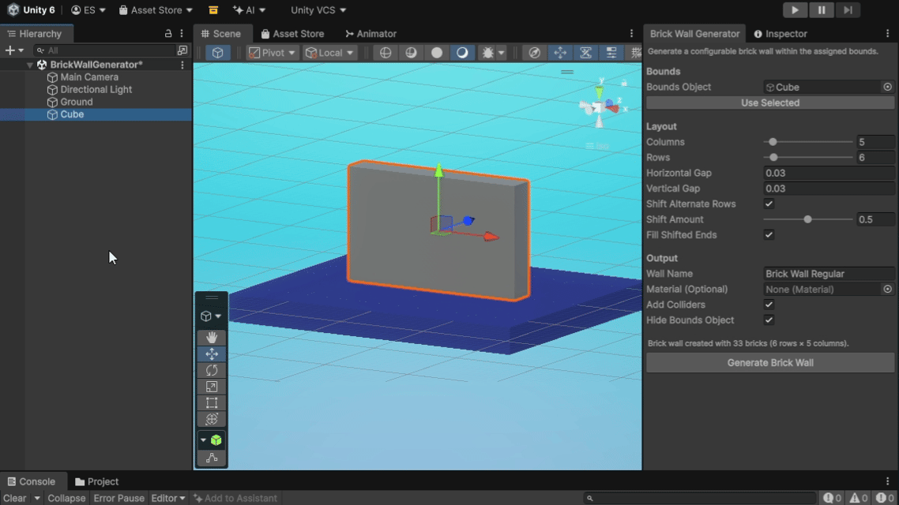
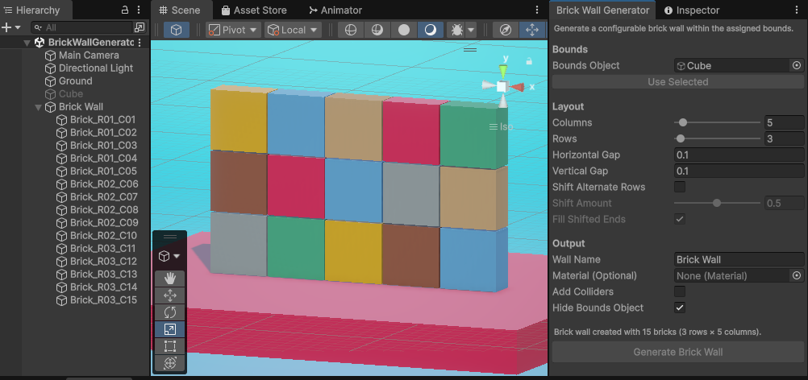

# Brick Wall Generator

Brick Wall Generator is a Unity Editor utility for creating a wall of individual cube bricks inside a user-defined Bounds Object volume. It avoids manually placing, sizing, and arranging repeated brick objects while keeping the generated result as ordinary Unity scene geometry.



## What It Does

Brick Wall Generator uses the rectangular rendered bounds of a scene object to define the generated wall's position, orientation, width, height, and depth.

Each generation creates a new independent wall made from Unity cube GameObjects. Generated walls are not linked back to the Bounds Object and are not automatically regenerated or replaced.

## Installation

Copy this file into an `Editor` folder in your Unity project:

```text
Editor/BrickWallGeneratorWindow.cs
```

Open the tool from:

```text
Tools > Brick Wall Generator
```

No packages, prefabs, materials, or other assets are required.

## Basic Usage

1. Create or choose a valid Bounds Object in the scene.
2. Open `Tools > Brick Wall Generator`.
3. Assign the Bounds Object directly, or select it and press `Use Selected`.
4. Configure the wall layout and output options.
5. Press `Generate Brick Wall`.
6. Continue working with the generated wall parent.

After successful generation, the generated wall parent is selected. Generation is additive: running the tool again creates another independent wall instead of updating or replacing an existing one.

## Controls

### Bounds

- `Bounds Object`: scene object whose direct `MeshRenderer` bounds define the wall volume, orientation, depth, and fallback material.
- `Use Selected`: assigns the current scene selection as the Bounds Object.

### Layout

- `Columns`: base number of bricks across each unshifted row, range `1-64`.
- `Rows`: number of brick rows within the bounds, range `1-64`.
- `Horizontal Gap`: space between base columns. The wall width stays fixed, so larger gaps shrink bricks.
- `Vertical Gap`: space between rows. The wall height stays fixed, so larger gaps shrink bricks.
- `Shift Alternate Rows`: offsets every other row in positive local X to create a staggered pattern.
- `Shift Amount`: percentage of the horizontal brick pitch used to offset shifted rows.
- `Fill Shifted Ends`: adds clipped partial bricks at shifted row edges so the row fills the bounds without extending outside.

### Output

- `Wall Name`: generated wall parent name. Empty names fall back to `Brick Wall`, and duplicate sibling names are made unique.
- `Material (Optional)`: material applied to all generated bricks when assigned.
- `Add Colliders`: keeps one `BoxCollider` on each generated brick. Turn off to create render-only bricks.
- `Hide Bounds Object`: deactivates the Bounds Object after a successful generation. Undo restores its previous active state.

`Fill Shifted Ends` can create additional partial edge bricks beyond the configured base `Columns` count.

## Bounds Object Requirements

The Bounds Object must be an active scene object with:

- a direct `MeshFilter`
- a valid mesh
- a direct enabled `MeshRenderer`
- valid positive rendered dimensions
- supported positive scale on the object and its ancestors

Child renderers are not used to calculate bounds. `SkinnedMeshRenderer`, `SpriteRenderer`, collider-only objects, transform-only objects, and other renderer types are outside the supported Bounds Object scope.

A collider is not required. The source mesh shape is not reproduced; its rectangular rendered bounds define the generated wall volume.

## Generated Output



Each successful generation creates a new wall parent next to the Bounds Object in the hierarchy. Generated bricks are children of that parent.

The generated parent has only a `Transform`. Generated bricks are normal Unity cube GameObjects with:

- `Transform`
- `MeshFilter`
- `MeshRenderer`
- optional `BoxCollider`

Generated walls are independent from the Bounds Object after creation. Existing generated walls are not automatically updated, replaced, or deleted.

## Materials

Material resolution order:

1. `Material (Optional)` override
2. first shared material on the Bounds Object's direct `MeshRenderer`
3. Unity default material behavior

If the Bounds Object renderer has multiple materials, only the first shared material is used as the fallback.

## Undo

Generation is registered as one Unity Undo operation.

Undo removes the generated wall and restores the Bounds Object active state if `Hide Bounds Object` deactivated it during generation.

## Scenes and Prefab Mode

The tool supports:

- normal scenes
- multi-scene editing
- scene prefab instances
- Prefab Mode / Prefab Stage

Generated output is created in the same editable scene or Prefab Stage context as the Bounds Object.

## Notes and Limitations

- `Columns` range: `1-64`
- `Rows` range: `1-64`
- High row and column values create many individual GameObjects.
- Positive non-uniform scale is supported.
- Supported positive scaled ancestors preserve the visible Bounds Object volume.
- Negative or zero scale on the Bounds Object or its ancestors is unsupported.
- `Fill Shifted Ends` can add partial bricks beyond the configured base `Columns` count.
- Generated walls are one-shot independent scene geometry.
- Existing walls are not automatically regenerated or replaced.
- Runtime generation is not supported.
- The source mesh shape is represented by rectangular bounds, not reproduced.

## Tested Unity Version

Developed and tested with Unity `6000.3.15f1`.

## License

This repository is available under the MIT License. See [LICENSE](LICENSE).
